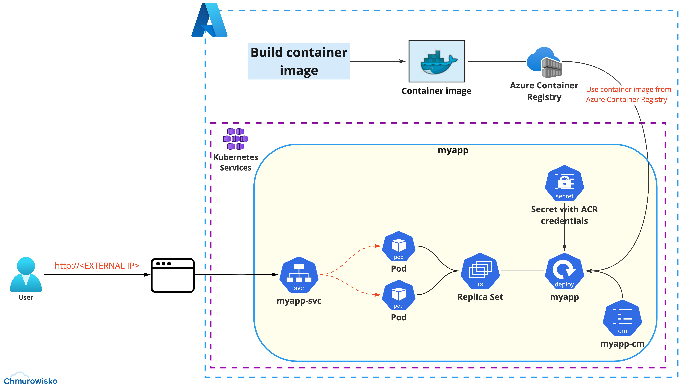

  
  
  

# Container Registry and Deployment with config map and service

## Lab Overview

In this lab you will:
- create Azure Container Registry (ACR)
- build container image using application -> [./app](./app) 
- push a container image to created Azure Container Registry
- create Secret with Azure Container Registry credentials
- create Config Map (**key**: `ENV_FROM_CONFIGMAP`, **value**: `Type what you want the application to show`). This Config Map will be a single evnironment variable `ENV_FROM_CONFIGMAP` with information that you will see in your application
- create deployment (add this container port to your YAML file of deployment (`- containerPort: 8081`) with 2 replicas and use container image that you build and pushed to ACR. Also remember to use Config Map that you created in the previous step
-  expose your app to the Internet on unique IP address. Deployment should use Secret with Azure Container Registry credentials 
-  using any browser of your choice, navigate to EXTERNAL-IP address of your service and check the result!

The following visualization will help you understand what you are supposed to do in the lab.

## Lab visualization:

  

