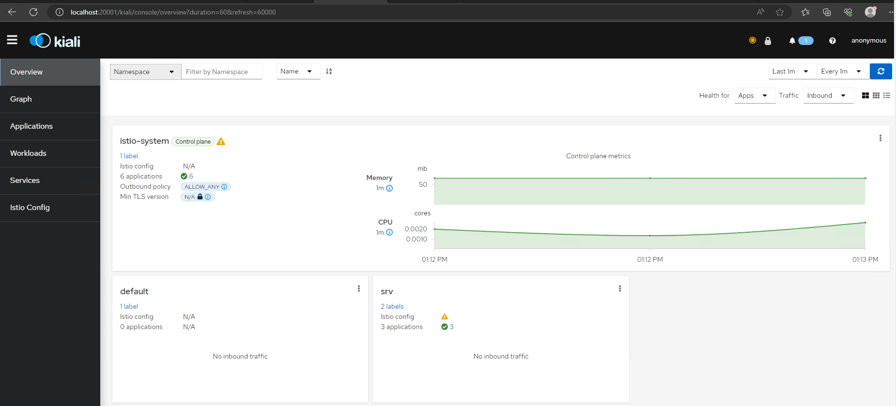

<br><br>
<br><br>
<br><br>

# Installing Istio

## LAB Overview

#### In this lab you will install Istio

## Task 1: Istio installation

1. Install istioctl on Your [machine](https://github.com/istio/istio/releases/tag/1.18.0) and set the path to the tool in Your system

2. Once done, install istio on the cluster by running commands:
    ```
    istioctl install --set profile=demo
    istioctl verify-install
    ```

3. Verify if the istio has been installed correctly by running commands:
    ```
    kubectl get ns
    kubectl -n istio-system get deploy
    kubectl get svc istio-ingressgateway -n istio-system
    ```

4. If above is correct, you have an istio on Your cluster and You can start using it in Your apps. To make it even more powerfull couple addons will make it more roboust. Checkout by your self the capabilities of Grafana, Prometheus and Kiali.
Once done, install all of them in the cluster (those installas are for demo purposes, for enterprise grade adjustments are required)
    ```
    kubectl apply -f https://raw.githubusercontent.com/istio/istio/release-1.18/samples/addons/grafana.yaml
    kubectl apply -f https://raw.githubusercontent.com/istio/istio/release-1.18/samples/addons/prometheus.yaml
    kubectl apply -f https://raw.githubusercontent.com/istio/istio/release-1.18/samples/addons/kiali.yaml
    ```

5. Once succesfull, please run the dashboard using istioctl.
    ```
    istioctl dashboard kiali
    ```
    
    
    *Your dashboard may not contain metrics at this point in time.*

## END LAB
<br><br>